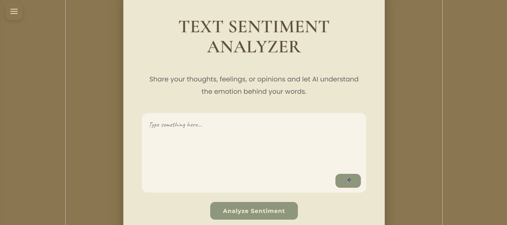
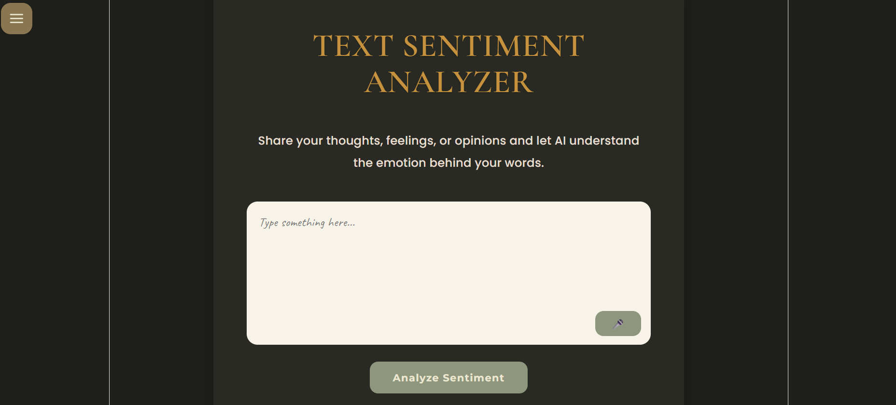
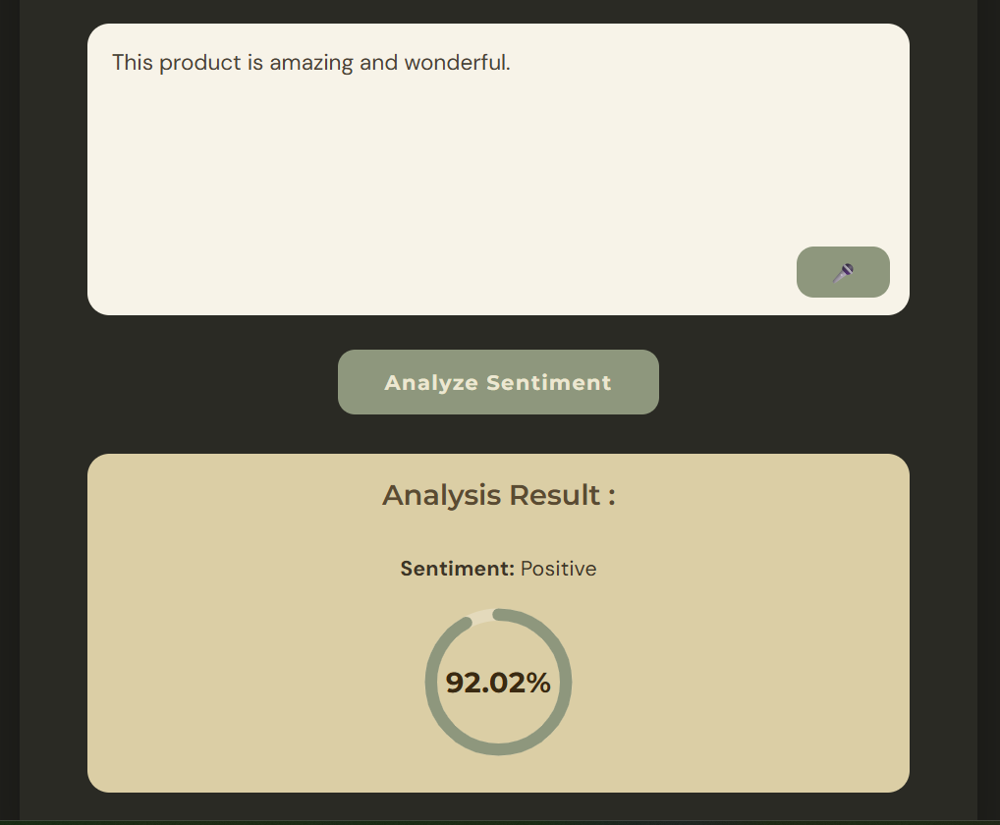
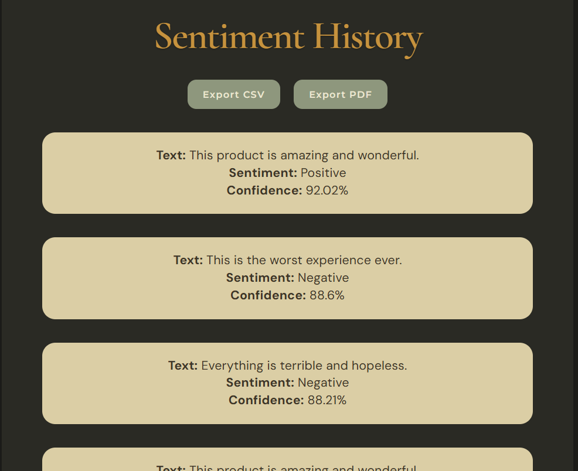
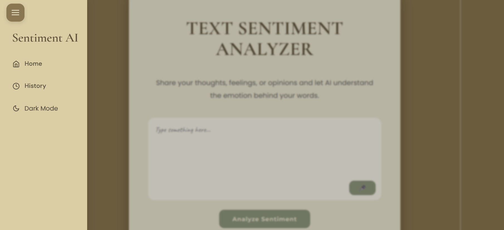

# ai-text-sentiment-analyzer

# AI Text Sentiment Analyzer

An AI-powered web application that analyzes the sentiment of user-entered text using Natural Language Processing and Machine Learning.

The application predicts whether text expresses a **Positive** or **Negative** sentiment and visually displays the confidence score using an interactive circular progress ring.

---

# Project Overview

This project combines a React frontend with a FastAPI backend to create a modern sentiment analysis application.

Users can:
- Enter text manually
- Use voice input through speech recognition
- Analyze sentiment using AI
- View confidence visualization
- Access previous sentiment history
- Export sentiment records to CSV and PDF
- Toggle between Dark and Light modes

The project demonstrates:
- Frontend development
- Backend API development
- Machine Learning integration
- REST API communication
- Database handling
- UI/UX design

---

# Features

- AI-powered sentiment analysis
- Confidence score visualization
- Voice input using Speech Recognition
- Sentiment history tracking
- Export history to CSV
- Export history to PDF
- Dark / Light mode
- Responsive UI design
- FastAPI REST API backend
- React frontend using Vite

---

# Technologies Used

## Frontend
- React.js
- Vite
- CSS3
- React Router DOM
- React Icons

## Backend
- FastAPI
- Python
- SQLAlchemy
- SQLite

## Machine Learning
- Hugging Face Transformers
- DistilBERT
- PyTorch

---

# Project Structure

```bash
AI Text Sentiment Analyzer/
│
├── backend/
│   ├── routes/
│   │   ├── analyze.py
│   │   └── history.py
│   │
│   ├── fine_tuned_model/
│   ├── main.py
│   ├── sentiment.py
│   ├── database.py
│   ├── model.py
│   └── schemas.py
│
├── frontend/
│   ├── public/
│   ├── src/
│   │   ├── assets/
│   │   ├── components/
│   │   ├── pages/
│   │   ├── App.jsx
│   │   └── App.css
│   │
│   ├── package.json
│   └── vite.config.js
│
├── requirements.txt
└── README.md
```

---

# Installation & Setup

## 1. Clone Repository

```bash
git clone https://github.com/annzbanz/ai-text-sentiment-analyzer.git
```

---

# Backend Setup

## 2. Navigate to Backend Folder

```bash
cd backend
```

## 3. Create Virtual Environment

```bash
python -m venv venv1
```

## 4. Activate Virtual Environment

### Windows

```bash
venv1\Scripts\activate
```

---

## 5. Install Backend Dependencies

```bash
pip install -r requirements.txt
```

---

## 6. Run FastAPI Backend

```bash
uvicorn main:app --reload
```

Backend Server:

```bash
http://127.0.0.1:8000
```

FastAPI Docs:

```bash
http://127.0.0.1:8000/docs
```

---

# Frontend Setup

## 7. Navigate to Frontend Folder

```bash
cd frontend
```

## 8. Install Frontend Dependencies

```bash
npm install
```

---

## 9. Run Frontend

```bash
npm run dev
```

Frontend runs at:

```bash
http://localhost:5173
```

---

# API Usage

## Analyze Sentiment

### Endpoint

```http
POST /api/analyze
```

---

## Request Body

```json
{
  "text": "I love this project"
}
```

---

## Response

```json
{
  "sentiment": "Positive",
  "confidence": 97.45
}
```

---

# Screenshots

## Home Page



---

## Dark Mode



---

## Sentiment Result



---

## History Page



---

## Sidebar Menu




# Future Improvements

- Neutral sentiment detection
- User authentication system
- Multilingual sentiment analysis
- Emotion classification
- Cloud deployment
- Real-time analytics dashboard


# Author

Developed by Ann.


# License

This project is created for learning purposes.
